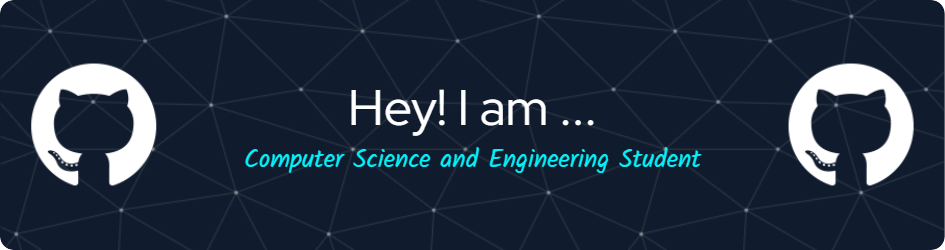

<h1 align="center">Hi 👋, I'm Kaushal Ramoliya</h1>
<h3 align="center">🚀 Passionate Developer | ⚡ Building Scalable Solutions | 🌍 Web Enthusiast</h3>

<h2 align="left">🧑🏻‍🎓 About Me</h2>
  

  
👋 I am Kaushal Ramoliya, a pre-final year Computer Science Engineering student, passionate about full-stack web development, mobile app development, and emerging technologies like AI. With a strong foundation in both frontend and backend development, I specialize in crafting scalable, efficient, and innovative solutions.

<h3 align="left">💻 Technical Expertise</h3>
<ul>
  <li><strong>Web Development:</strong> Frontend & Backend (Full-Stack)</li>
  <li><strong>Mobile Development:</strong> Android (Exploring Flutter for cross-platform solutions)</li>
  <li><strong>Emerging Technologies:</strong> AI-driven solutions & smart automation</li>
  <li><strong>Programming Languages:</strong> C, Java, Python, HTML, CSS, JavaScript, React</li>
</ul>

  📩 Let's Connect! I'm always open to discussing new projects, collaborations, or tech innovations. Feel free to connect and explore ideas together! 🤝

<h2 align="lef">🌐 Connect with me</h2>

    
    
  

  
<h2 align="left">💻Languages and Tools:</h2>

 
   
   
   
   
   
   
   
   
   
   
   
   
   
   
   

<h2 align="left">⚡️Stats</h2>

  
  &nbsp;

  

