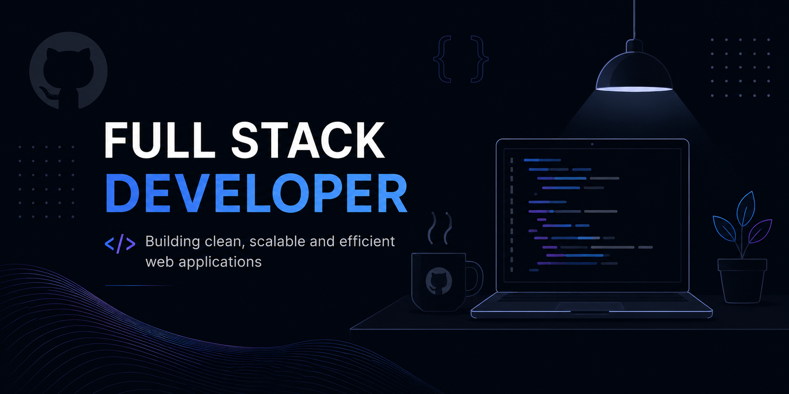

<h1 align="center">Hi 👋, I'm Kaushal Ramoliya</h1>
<h3 align="center">🚀 Full Stack Developer | ⚡ Building Scalable Solutions | 🤖 AI, ML & NLP Enthusiast</h3>

<h2 align="left">🧑🏻‍💻 About Me</h2>

👋 I'm Kaushal Ramoliya, a Full Stack Developer currently working as a **Software Engineer at Code Theorem**, based in Ahmedabad, Gujarat, India. I specialize in designing and architecting high-performance digital systems that solve real-world problems with clarity, precision, and long-term impact.

I focus on transforming complex challenges into structured, production-ready solutions — managing the full lifecycle from system architecture and backend engineering to frontend implementation and cloud deployment, with an emphasis on scalability, maintainability, clean code, and performance optimization.

### 🔧 Core Expertise
- 🖥️ Full Stack Software Engineering
- 🏗️ Scalable System Architecture
- ⚙️ Backend Development & API Engineering
- 🗄️ Database Design & Optimization
- ☁️ Cloud Deployment & Infrastructure Strategy
- 🤖 AI-Integrated Application Development

### 🌟 Highlight Project
**PoolSafar** — a real-world transportation optimization solution built as a scalable mobility framework focused on reducing parking congestion, lowering commuting costs, and minimizing environmental impact through intelligent ride coordination and optimized system logic. Architected with scalability at its core, it integrates real-time workflows, efficient data modeling, and expansion-ready backend infrastructure to support institutional and large-scale adoption.

I work extensively with **Java, Python, JavaScript/TypeScript, React.js, Next.js, Node.js, and Dart**, focusing on writing clean, maintainable, production-grade code. My technical foundation extends into **Artificial Intelligence, Machine Learning, and Natural Language Processing**, and as an **AWS Certified professional**, I leverage cloud technologies to build secure, scalable, and performance-optimized applications.

📩 Always open to collaborating on forward-thinking software initiatives that combine innovation, scalability, and meaningful impact. Let's connect!

 
<h2 align="left">🌐 Connect with me</h2>

    
    
  

<h2 align="left">💻 Languages and Tools:</h2>

  
  
  
  
  
  
  
  
  
  
  
  
  
  
  
  
  
  
  
  
  
  
  

<h2 align="left">🛠️ Currently</h2>

- 🔭 Currently working as a **Software Engineer at [Code Theorem](https://codetheorem.co/)**
- 🌱 Currently deepening my skills in **AI-integrated application development** and cloud architecture
- 💡 Building **PoolSafar** — a scalable ride-coordination platform tackling commuting inefficiencies
- 📫 Reach me at: **[LinkedIn](https://www.linkedin.com/in/kaushalramoliya/)**

<h2 align="left">🚀 Featured Projects</h2>

<table align="center">
  <tr>
    <td width="50%">
      <h3>🚗 PoolSafar</h3>
      
A real-world transportation optimization platform reducing parking congestion, commuting costs, and environmental impact through intelligent ride coordination, real-time workflows, and scalable backend infrastructure.

    </td>
    <td width="50%">
      <h3>🌐 UKF Sea & Air Cargo Services</h3>
      
End-to-end corporate website for a Dubai-based logistics company — from requirement gathering and responsive UI design to deployment. Live at <a href="https://ukfservices.com/">ukfservices.com</a>.

    </td>
  </tr>
</table>

<h2 align="left">⚡️ Stats</h2>

  

<h2 align="left">🐍 Contribution Snake</h2>

  

